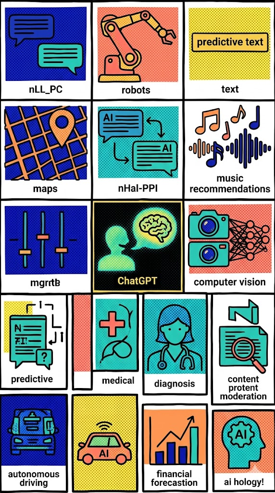
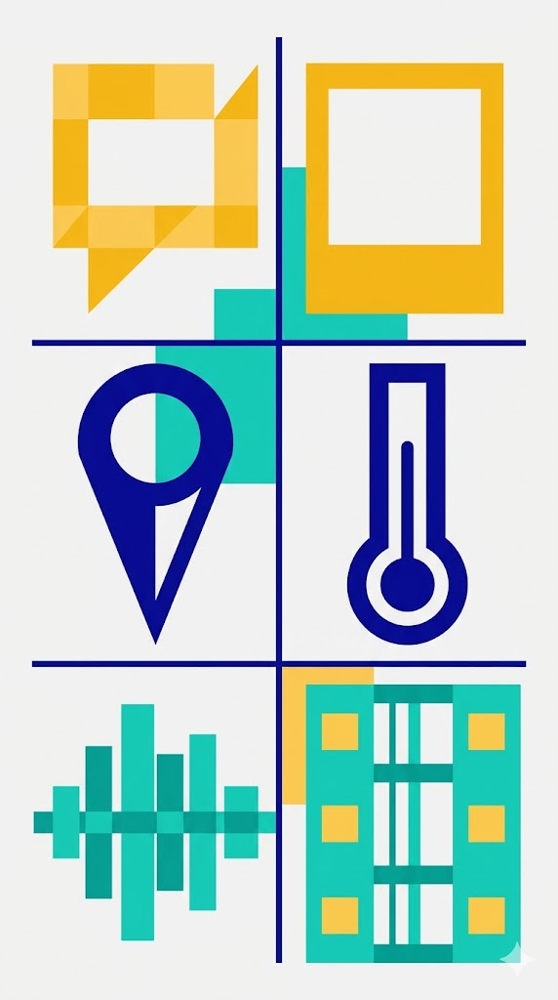
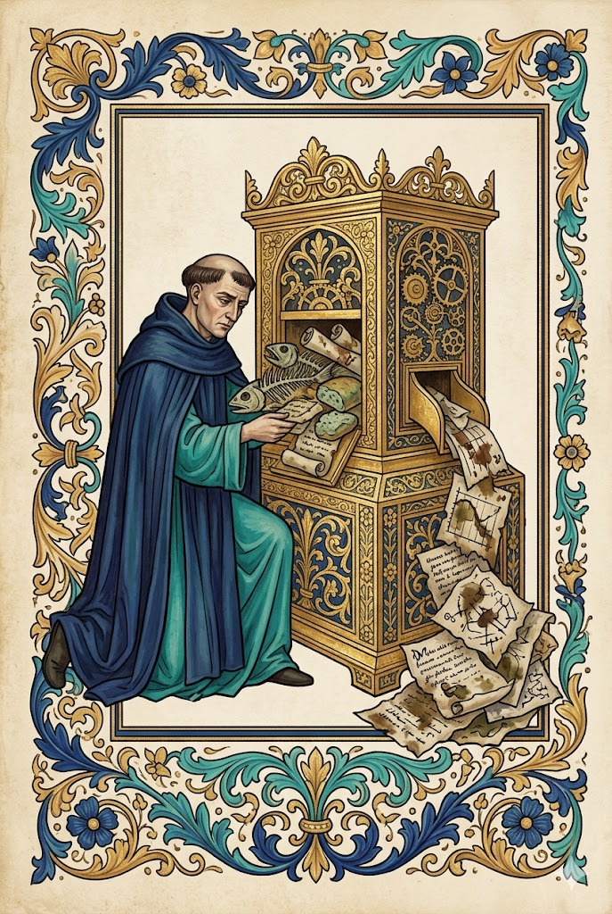
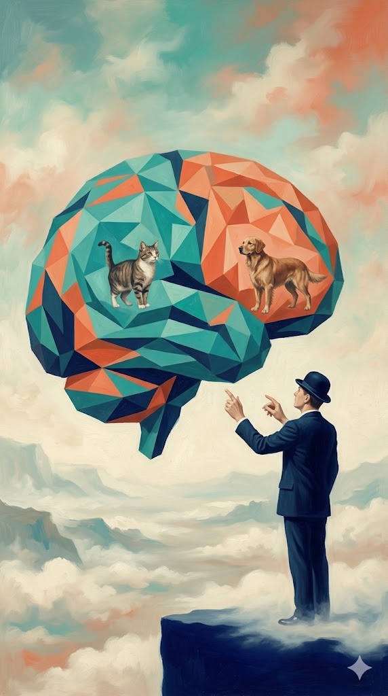
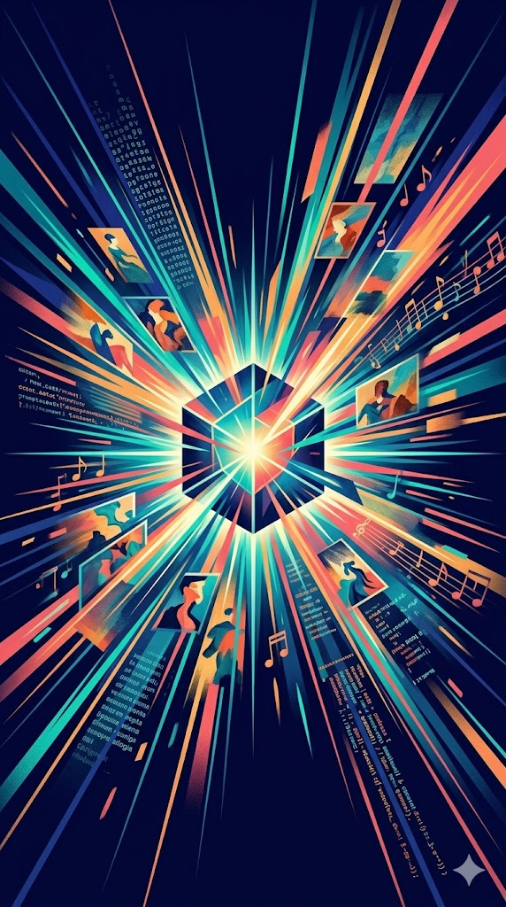
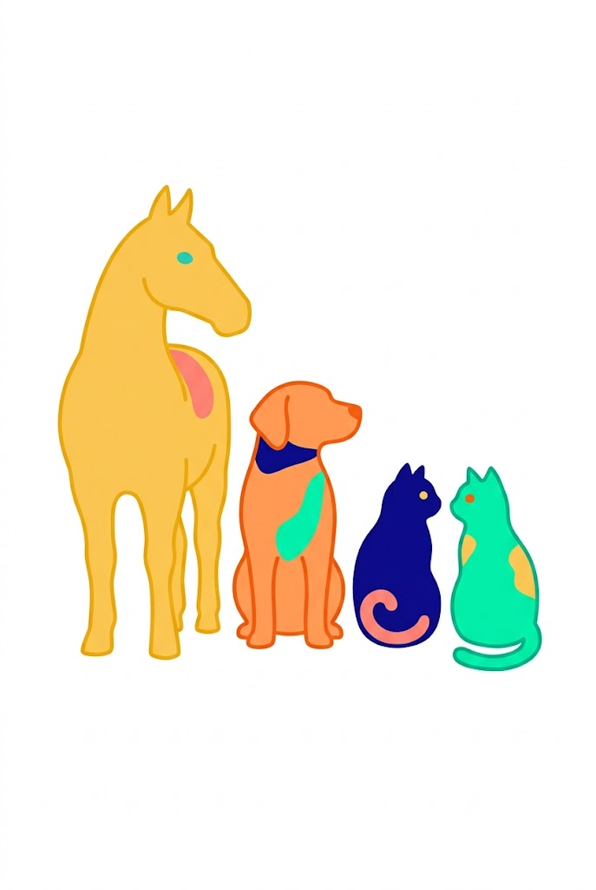
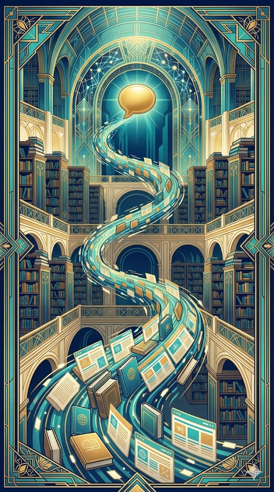
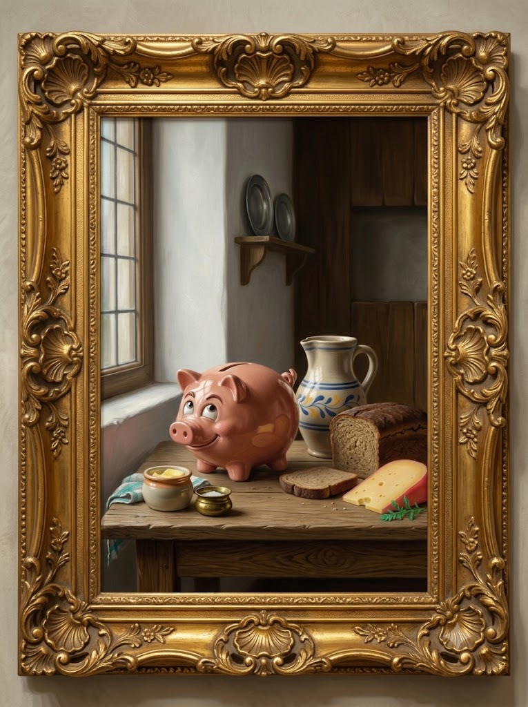
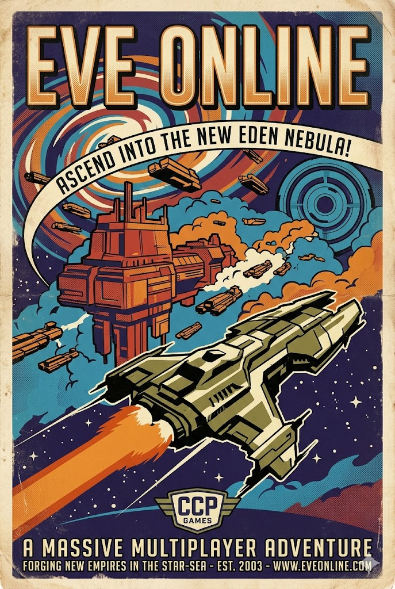



<aside class="notes">
Okkur til aðstoðar í dag er <strong>Brynjólfur Stefánsson</strong>.

Brynjólfur er meistaranemi í tölvunarfræði á netöryggissérsviði. Hann starfar sem aðstoðarrannsakandi við Tölvunarfræðideild Háskóla Íslands, þar sem hann sinnir rannsóknum og kennslu á sviði netöryggis.

Hann starfar einnig sem verkefnastjóri hjá NýMennt á Menntavísindasviði og leiðir þar verkefni eins og First Lego League (FLL), World Robot Olympiad (WRO) og Ungt vísindafólk (EUCYS).
</aside>

---

## {#menti-login .focus-slide .menti-login intro="Skannaðu QR kóðann"}

---

## {#menti-1 data-menti="true"}

<aside class="notes">Menti #1 · Word Cloud: Hvað dettur þér fyrst í hug þegar þú heyrir orðið „gervigreind“?</aside>

---

## {.img-split}

Aðalpunktur dagsins
<h2>Gervigreind er meira en ChatGPT</h2>

Margir setja samasemmerki á milli <strong>spunagreindar</strong> og <strong>gervigreindar</strong>.

ChatGPT er eitt dæmi um gervigreind — ekki öll gervigreind.

Það er svipað og að halda að internetið sé bara TikTok.

<aside class="notes">
Þetta er aðalpunkturinn í dag — snúðu alltaf aftur hingað.

Spurðu bekkinn: „Hvað er gervigreind?" — gefðu þeim smá tíma. Flestir munu nefna ChatGPT, og það er nákvæmlega rétt upphaf.

TikTok-analogían virkar vel: TikTok er eitt app sem notar gervigreind — en gervigreind er í veðurspám, Spotify, sjálfkeyrandi bílum og heilbrigðisþjónustu.
</aside>
<figure>

<figcaption class="caption-prompt">Pop Art (Warhol): A bold Warhol-style grid where ChatGPT is one small bright panel among many — computer vision, maps, robots, music recommendations — each panel a vivid screenprint colour. Palette: #10099F #2DD2C0 #FAC55B #FC8484 #FFA05F on white. Thick outlines, flat halftone dots, no text, portrait mode.</figcaption>
</figure>

---

Leiðin í dag
<h2>Rauði þráðurinn</h2>

Allt byrjar á gögnum — og endar í betri ákvörðunum.

::: {.steps}
- Gögn | upplýsingar
- Gagnavísindi | skilja mynstur
- Gervigreind | læra mynstur
- Spár | hvað gæti gerst?
- Ákvarðanir | hvað eigum við að gera?
:::
<aside class="notes">
Farðu í gegnum örin hægt — þetta er vegvísirinn í gegnum allan tímann.

Leggðu áherslu: við byrjum alltaf á gögnum. Án gagna ekkert annað.

Við förum í gegnum hvert skref á eigin glæru síðar.
</aside>

---

Markmið
<h2>Eftir tímann eigið þið að geta...</h2>

::: {.fa-card}
- 1 | | Útskýrt hvað gögn eru.
- 2 | | Lýst hvað gagnavísindi eru.
- 3 | | Skilið muninn á gagnavísindum og gervigreind.
- 4 | | Útskýrt í grófum dráttum hvernig ChatGPT virkar.
- 5 | | Skilið að spunagreind er aðeins ein tegund gervigreindar.
- 6 | | Spurt gagnrýninna spurninga um svör frá gervigreind.
:::
<aside class="notes">
Farðu stuttlega yfir markmið — ekki dvelja lengi hér.

Bentu á að við förum í þetta í röð í gegnum tímann. Seðju nemendur að þetta séu hlutir sem ÞEIR muni geta útskýrt eftir tímann — ekki bara þú.
</aside>

---

## {.img-split}

Kafli 1
<h2>Hvað eru gögn?</h2>

Gögn eru ekki bara tölur í Excel.

::: {.fa-card}
- font | Texti | Skilaboð, greinar, bækur
- image | Myndir | Ljósmyndir, teikningar
- map-location-dot | Staðsetningar | GPS hnit, kort
- ruler-horizontal | Mælingar | Hitastig, hraði, þyngd
- volume-high | Hljóð | Tónlist, tal, hljóðbylgjur
- video | Myndbönd | Klippur, streymi, kvikmyndir
:::

Öll gögn í tölvum eru á endanum umbreytt í bita, þ.e. 0 og 1.

<aside class="notes">
Leggðu áherslu: gögn eru ekki bara tölur. Texti úr Snapchat-skilaboðum eru gögn. Mynd sem þú setur á Instagram eru gögn. Rödd þín í símtali eru gögn.

Spurðu: „Hvaða tegund gagna notið þið mest á daginn?" — myndir? tónlist? textar?
</aside>
<figure>

<figcaption class="caption-prompt">Bauhaus/Constructivism: Six bold geometric shapes representing data types — a speech bubble (text), a polaroid frame (photos), a map pin (location), a thermometer (sensor), a soundwave (audio), a film strip (video). Flat Bauhaus composition, primary grid layout. Palette: #10099F #2DD2C0 #FAC55B on #F5F5F5. no text, portrait mode.</figcaption>
</figure>

---

## {#menti-2 data-menti="true"}

<aside class="notes">Menti #2 · Open Ended: Hvaða gögn heldurðu að síminn þinn safni um þig?</aside>

---

<h2>Gögn geta verið alls konar</h2>

Gögn eru upplýsingar.

Í hvert skipti sem við gerum eitthvað í rafrænum heimi verða til gögn.

::: {.fa-card}
- computer-mouse | Smellum | Hvaða hnapp var ýtt á?
- keyboard | Skrifum | Hvaða orð voru slegin inn?
- eye | Horfum | Hversu lengi var horft?
- headphones | Hlustum | Hvaða lag var spilað?
- location-dot | Hreyfum okkur | Hvar er síminn?
- gauge-high | Mælum | Hiti, hraði, tími, fjöldi.
:::

<aside class="notes">
Spurðu: „Hvaða gögn safnar síminn ykkar um ykkur á einum degi?" — láttu nokkra svara.

Áréttaðu: gögn verða til sjálfkrafa, við þurfum ekki alltaf að vera meðvituð um það. Þegar þú hlustar á lag, hreyfir þig, skrifa skilaboð — allt verður að gögnum.
</aside>

---

## {.img-split}

Kafli 2
<h2>Hvað eru gagnavísindi?</h2>

Gagnavísindi snúast um að nota gögn til að skilja heiminn betur —
finna mynstur, draga ályktanir og taka betri ákvarðanir.

Gagnavísindamenn nota stærðfræði, tölfræði og tölvunarfræði til að breyta hráum gögnum í
gagnlegar upplýsingar.

<aside class="notes">
Gagnavísindi = gögn + stærðfræði + forritun + spurningagjörð.

Góð samlíking: gagnavísindamaður er eins og detektívur sem notar gögn í stað vísbendinga. Hann/hún spyr: „Hvað er að gerast? Af hverju? Hvað gæti gerst næst?"

Markmiðið er skilningur og betri ákvarðanataka — ekki bara tölur.
</aside>
<figure>

<figcaption class="caption-prompt">Impressionism: A scientist standing before a glowing canvas of swirling data points that slowly resolve into clear charts and patterns, Monet-style loose brushstrokes and dappled light. Palette: #10099F #2DD2C0 #00FFBA with warm ivory #F5F0E8 highlights. Painterly texture, no text, portrait mode.</figcaption>
</figure>

---

<h2>Gagnavísindi í raunveruleikanum</h2>
::: {.fa-card}
- cloud-sun-rain | Veðurspá | Veðurstöðvar og gervihnettir mæla hitastig, vind og loftþrýsting. Gögnin eru greind til að spá fyrir um veðrið.
- [brands] spotify | Spotify | Spotify skoðar hvaða lög þú hlustar á, hvenær og hversu lengi, og finnur mynstur í hlustun.
- gamepad | Leikjahönnun | Hönnuðir skoða hvar leikmenn festast, hvar þeir hætta og hvað þeim finnst skemmtilegt.
- [brands] youtube | YouTube | Mælir horftíma, líkingar og hlutfall til að spá fyrir um hvaða myndband þú vilt sjá næst.
- map | Google Maps | Greinir umferðargögn frá milljónum bíla í rauntíma og finnur hraðustu leið fyrir þig.
- [brands] snapchat | Snapchat | Andlitsgreining þekkir lögun andlits þíns á millisekúndu til að beita síum nákvæmlega.
:::
<aside class="notes">
Farðu í gegnum dæmin og spurðu hvort nemendur þekki þau.

Veðurspá: milljónir gagna á sekúndu frá veðurstöðvum um allan heim — við fáum nákvæma 10 daga spá.

Spotify: Discover Weekly er búinn til eingöngu með gagnavísindum. Af 100 milljónum laga finnur kerfið þau 30 sem þú vilt heyra.

YouTube: 70% af öllu horftíma kemur frá ráðleggingakerfinu — kerfið velur næsta myndband á 0,2 sekúndum.

Google Maps: spáir umferð út frá gögnum frá milljónum bíla í rauntíma — og sögulegum mynstrum.

Snapchat: kortleggur 68 punkta á andlitinu þínu og uppfærir 30 sinnum á sekúndu — þess vegna fylgja síurnar þér.

Spurðu nemendur: „Hafið þið einhvern tíma velt því fyrir ykkur hvernig YouTube veit hvað þið viljið sjá?"
</aside>

---

## {.img-split}

<h2>Ferlið í gagnavísindum</h2>

Skref fyrir skref: úr hráu efni í niðurstöðu.

::: {.steps}
- Safna gögnum | mæla, skrá, safna
- Greina gögn | hreinsa, flokka, skoða
- Finna mynstur | hvað endurtekur sig?
- Draga ályktanir | hvað þýðir þetta?
:::

<strong>Regla:</strong> án góðra gagna eru engar góðar niðurstöður.

<aside class="notes">
Farðu í gegnum skrefin hægt — hvert skref er eigin fagsvið.

Lykilsetningin: „Rubbish in, rubbish out." Ef við setjum inn slæm gögn fáum við slæmar niðurstöður. Gott dæmi: ef við þjálfum gervigreind eingöngu á myndum af köttum, mun hún telja að allir hundar séu kettir.

Spurðu: „Hvað heldið þið að sé erfiðasta skrefið?" — oft er það að hreinsa og undirbúa gögnin.
</aside>

<figure>

<figcaption class="caption-prompt">Medieval illuminated manuscript: A robed monk solemnly feeds rotting fish bones, crumpled scrolls and mouldy bread into an ornate gilded computing machine decorated with intricate floral borders — while corrupted, stain-covered charts and illegible parchments tumble out the other side. Aged parchment background, tempera paint, gold leaf details. Palette: #10099F #2DD2C0 #FAC55B on warm #F5F0E8. No text, portrait mode.</figcaption>
</figure>

---

## {#menti-3 data-menti="true"}

<aside class="notes">Menti #3 · Multiple Choice: Hvort myndir þú frekar nota til að spá fyrir um næsta YouTube-myndband vinar þíns?</aside>

---



---

## {.img-split}

Kafli 3
<h2>Hvað er gervigreind?</h2>

Gervigreind er þegar tölvur læra af gögnum og nota það sem þær læra til að taka ákvarðanir eða gera spár.

Það er eins og að kenna tölvunni að þekkja mynstur — til dæmis muninn á ketti og hundi eftir að hafa séð mörg dæmi.

<aside class="notes">
Ketti/hundur dæmið er frábær upphafspunktur — nemendur skiljá það strax.

Spurðu: „Hvernig heldið þið að tölvan lærir muninn á ketti og hundi? Sér hún reglur eins og „kettir hafa þríhyrningaeyru", eða notar hún eitthvað annað?" — svarið er: hún sér þúsundir mynda og lærir sjálfkrafa.

Áréttaðu: tölvan þarf MÖRG dæmi. Þess vegna safna fyrirtæki eins og Google og Meta gögnum — til þess að þjálfa gervigreind.
</aside>
<figure>

<figcaption class="caption-prompt">Surrealism (Magritte): A bowler-hatted figure teaching a floating geometric brain to distinguish a cat from a dog, dreamlike sky background, impossible scale. Palette: #10099F #2DD2C0 #FFA05F on misty #F5F0E8. Oil-paint texture, no text, portrait mode.</figcaption>
</figure>

---

<h2>Gagnavísindi og gervigreind er nátengt</h2>

en eru ekki alveg það sama

::: {.oppose left="Gagnavísindi" right="Gervigreind" left-icon="microscope" right-icon="brain"}
- Reynir að skilja gögn | Reynir að læra af gögnum
- Finnur mynstur í gögnum | Lærir mynstur sjálfkrafa
- Lýsir því sem gerðist | Spáir fyrir um hvað gæti gerst
- Hjálpar fólki að taka ákvarðanir | Getur tekið hluta af ákvörðuninni
:::

<aside class="notes">
Farðu í gegnum töfluna línu fyrir línu — ekki of hratt.

Leggðu áherslu á þriðju línuna: gagnavísindi lýsa fortíðinni, gervigreind spáir fyrir um framtíðina.

Gott dæmi: gagnavísindi segja „90% nemenda sem mæta illa í september falla úr námi" — gervigreind getur spáð HVERJIR eru í hættu og sett inn stuðning fyrirfram.
</aside>

---

<h2>TL;DR</h2>
::: {.fa-card}
- microscope | Gagnavísindi — mannlegi þátturinn | Við spyrjum, skoðum og túlkum gögn til að skilja heiminn og taka betri ákvarðanir.
- brain | Gervigreind — sjálfvirki þátturinn | Tölvan lærir sjálfkrafa af gögnum og gerir spár — án þess að við þurfum að forrita hverja reglu.
:::

::: {.steps}
- Gögn | upplýsingar
- Gagnavísindi | skilja mynstur
- Gervigreind | læra mynstur
- Spár | hvað gæti gerst?
- Ákvarðanir | hvað eigum við að gera?
:::
<aside class="notes">
Þetta er kjarninn — tvær setningar sem nemendur ættu að geta tekið með sér heim.

Þjálfaðu þá: „Segið mér muninn á gagnavísindum og gervigreind með einni setningu." Láttu tvo eða þrjá svara.
</aside>

---

## {#menti-4 data-menti="true"}

<aside class="notes">Menti #4 · Ranking: Hvar heldurðu að gervigreind sé mest notuð í dag?</aside>

---

<h2>Gervigreind er regnhlífarhugtak</h2>
:::{.fa-card}
- chart-simple | Spálíkön | Spá fyrir um eftirspurn, veður eða hegðun.
- camera-retro | Myndgreining | Greina myndir, t.d. andlit, ketti, bíla eða sjúkdóma
- route | Bestun| Finna góða leið, gott plan eða góða röðun.
- language | Málgreining | Skilja texta, þýða, flokka og svara.
- flask-vial | Hermun | Prófa „hvað ef?“ án þess að prófa í raunheimi.
- wand-magic-sparkles | Spunagreind | Búa til texta, myndir, hljóð, kóða eða myndband
:::
<aside class="notes">
ChatGPT er í flokki „Spunagreind" — aðeins einn af sex flokkum hér.

Spurðu: „Hvar heldið þið að gervigreind sé mest notuð — í hvaða flokki?" — svarið er oft myndgreining (lækningar, ökutæki) og spálíkön (fjármál, veður).

Bíddu með Menti #4 niðurstöðurnar til að bera þær saman við þetta.
</aside>

---

<h2>Gervigreind í raunveruleikanum</h2>
:::{.fa-card}
- fish | Fiskvinnsla | Gögn úr myndavélum hjálpa vélum að skera fisk þannig að minna fari til
spillis.
- mountain-sun | Ferðaþjónusta | Gögn um áhuga, tíma og staðsetningu hjálpa til við að mæla með ferðum.
- calendar-days | Vaktaplön | Gögn um þörf, frí og reglur hjálpa til við að raða fólki á
vaktir.
:::
<aside class="notes">
Fiskvinnsla: myndavélar skanna fiskinn, gervigreind þekkir bestu skurðarlínuna og vélin sker nákvæmlega — minna fer til spillis.

Ferðaþjónusta: þegar þú lítur á myndband af foss á Instagram gæti kerfið nú þegar verið að mæla með Íslandsferð við þig — eftir viðveru, verð og áhuga þinn.

Vaktaplön: stór sjúkrahús nota slík kerfi til þess að raða hjúkrunarfræðingum og læknum þannig að alltaf sé rétt menntað fólk til staðar.
</aside>

---



---

## {.img-split}

Kafli 4
<h2>Hvað er spunagreind?</h2>

Spunagreind er ein tegund gervigreindar sem býr til nýtt efni.

Spunagreind sýnir okkur líka hvað var í gögnunum.

:::{.fa-card}
- pen-nib | Texti | Greinar, svör, sögur, þýðingar.
- palette | Myndir | Nýjar myndir út frá lýsingum.
- code | Annað efni | Tónlist, kóði, myndbönd og fleira.
:::

Þekkt dæmi — tæki sem hafa breytt heiminum:

ChatGPT
Copilot
Claude
Gemini
Midjourney
DALL-E
Suno

<aside class="notes">
Núna komum við að því sem flestir þekkja — spunagreind. Þetta eru tækin sem hafa breytt heiminum á undanförnum árum: ChatGPT, Copilot, Gemini, Claude.

Spunagreind er sú tegund gervigreindar sem nemendur þekkja best — en það er mikilvægt að þeir sjái að hún er hluti af stærri mynd.

Önnur dæmi: Midjourney og DALL-E búa til myndir, Suno búar til tónlist, GitHub Copilot skrifar kóða.

Spurðu: „Hefur einhver ykkar notað AI til að búa til mynd eða tónlist?" — líklegt að einhver hafi.
</aside>

<figure>

<figcaption class="caption-prompt">Futurism: A glowing prompt box at centre exploding outward into streams of text, painted images, musical notes and code — Italian Futurist diagonal energy lines. Palette: #10099F #00FFBA #FAC55B #FC8484 on deep navy #050330. High contrast, motion blur, no text, portrait mode.</figcaption>
</figure>

---

## {.img-split}

Líking: Dýrategundir
<h2>Spunagreind ≠ gervigreind</h2>

Hundur, köttur og hestur eru allir <strong>dýr</strong> — en þau eru mismunandi tegundir.

Á sama hátt eru til <strong>mismunandi tegundir gervigreindar</strong>. Ein þeirra er spunagreind.

Spunagreind er <strong>ein tegund</strong> af gervigreind — ekki það sama og gervigreind.

<aside class="notes">
Notaðu dýra-analóguna: „Collies eru hundar, en ekki allir hundar eru collies." Spunagreind er gervigreind, en ekki öll gervigreind er spunagreind.

Þetta villa er mjög algeng — jafnvel í fjölmiðlum. Þegar fólk segir „gervigreind gerir þetta" meina þeir oft spunagreind eingöngu.
</aside>
<figure>

<figcaption class="caption-prompt">Fauvist minimalism: A horse, a dog, and two cats standing side by side in a straight row, simplified bold shapes and clean outlines — flat color blocks with playful, expressive forms. Palette: #10099F #2DD2C0 #00FFBA #FAC55B #FC8484 #FFA05F on white background. High contrast, warm accents, no text, portrait mode.</figcaption>
</figure>

---

Kafli 5 · ChatGPT
<h2>Hvernig virkar ChatGPT?</h2>

Botnaðu setninguna:

„Hvernig hefurðu ___________?"

Líklegasta svarið er <strong>„það"</strong> eða <strong>„það í dag"</strong>. Þið gerðuð það sjálfkrafa — án þess að hugsa.

<aside class="notes">
Kynna Menti-leikinn vel: „Við ætlum að klára þessa setningu saman. Skrifið fyrsta orðið sem kemur í hug."

Bíddu eftir Menti-niðurstöðunum áður en þú ferð áfram.
</aside>

---

## {#menti-5 data-menti="true"}

<aside class="notes">Menti #5 · Open Ended: Kláraðu setninguna: „Ég fór að kaupa ...“</aside>

---

<h2>Þið voruð ekki að leita að rétta svarinu.</h2>

smjör

ost

Þið voruð að giska á líklegasta næsta orðið.

ChatGPT gerir nákvæmlega það sama — og því skiptir samhengi máli:

::: {.fa-card}
- circle-xmark | Erfitt — of lítið samhengi | „Ég fór að kaupa..." — ChatGPT hefur engar vísbendingar um hvað kemur næst.
- circle-check | Auðveldara — meira samhengi | „Ég fór í Bónus að kaupa mjólk, brauð og..." — ChatGPT sér mynsturið og svarar nánar.
:::

<aside class="notes">
Bentu á niðurstöður Menti: flestir völdu líklegt matvæli — smjör, mjólk, brauð o.s.frv.

„Þið voruð að giska á líklegustu svörin. ChatGPT gerir nákvæmlega það sama, bara mun hraðar og úr gríðarlegu magni af texta."

Þetta er prompt engineering í hnotskurn — mjög gagnleg lífsleikni. Sama gildir um líf: „Getur þú hjálpað mér?" vs. „Ég er að skrifa ritgerð um loftslagsbreytingar fyrir 9. bekk, getur þú hjálpað mér að finna þrjár sterkar rökstuðningar?"

Hvettu nemendur til að gefa ChatGPT samhengi þegar þeir nota það.
</aside>

---

## {.img-split}

<h2>Hvernig lærir ChatGPT?</h2>

::: {.steps}
- Lesa texta | ChatGPT las milljónir bóka, greina og vefsíðna.
- Finna mynstur | Það lærði hvaða orð koma oft saman og leggur það á  minnið.
- Spá fyrir | Nú getur það klárað setningar og svarað spurningum.
:::

<strong>Lykilhugmynd:</strong> ChatGPT skilur ekki tungumál eins og þú. Það <strong>giskar</strong> á hvað er líklegast að fylgja á eftir — orð fyrir orð.

<aside class="notes">
ChatGPT var þjálfað á nánast öllu sem hefur verið skrifað á internetinu — bækur, greinar, Wikipedia, spjallborð.

Við það fór það úr hundruðum gígabæta af texta í eitt líkan sem getur átt samtal.

Þjálfunin tók mánuði og milljóna dollara í tölvuafl — en notkun tekur millisekúndur.
</aside>
<figure>

<figcaption class="caption-prompt">Art Deco: An ornate 1930s library where books and webpages spiral upward into a glowing Art Deco archway labelled with neural connections, then emerge as a golden chat bubble. Palette: #10099F #2DD2C0 #FAC55B #F5F0E8 with metallic gold accents. Geometric borders, no text, portrait mode.</figcaption>
</figure>
---

## {.img-split}

<h2>Það skrifar ekki allt svarið í einu</h2>

Það velur <b>eitt</b> næsta orð. Svo notar það nýju setninguna til að velja næsta
orð.

::: {.steps}
- Ég fór í Bónus að kaupa
- mjólk | Ég fór í Bónus að kaupa mjólk
- brauð | Ég fór í Bónus að kaupa mjólk, brauð
- og | Ég fór í Bónus að kaupa mjólk, brauð og
- smjör| Ég fór í Bónus að kaupa mjólk, brauð og smjör
:::

Textinn sem kemur út verður hluti af næsta inntaki.

<aside class="notes">
Þetta útskýrir af hverju ChatGPT getur farið úrskeiðis í löngum svörum — hvert orð velur næsta, og ef eitt orð er rangt getur allt farið úr laginu.

Þess vegna er mikilvægt að lesa yfir og athuga — sérstaklega í mikilvægum textum.
</aside>
<figure>

<figcaption class="caption-prompt">Vermeer still life, Bónus piggy bank mascot, wooden table with milk jug, bread loaf, cheese, butter, soft window light from the side, dutch golden age interior, calm composition, realistic textures, limited color accents using #10099F #2DD2C0 #00FFBA #FAC55B #FC8484 #FFA05F applied subtly, warm natural tones dominant, painterly lighting, quiet atmosphere, no text, portrait.</figcaption>
</figure>

---

Kafli 6
<h2>Af hverju gerir ChatGPT mistök?</h2>

Vegna þess að góð spá er ekki alltaf rétt.

:::{.fa-card}
- dice | Það er að spá | Ekki alltaf að finna „rétta“ svarið.
- volume-high | Það getur hljómað sannfærandi|Jafnvel þegar svarið er rangt.
- magnifying-glass | Það þarf að vera gagnrýninn | Sérstaklega í heilsu, lögum, peningum og
heimildum
:::
<aside class="notes">
ChatGPT hallucinations — það uppfinnur heimildir, nöfn og staðreyndir með fullkomnum öryggi.

Gott dæmi: einhver bað ChatGPT um að finna vísindarannsóknir um eitthvað — það búði til fimm rannsóknir með réttum nöfnum, dagsetningum og tímaritum sem existuðu ekki.

Lykilskilaboð: ChatGPT er gott tól en slæmur sérfræðingur. Notaðu það til að kynna þér efni, en athugaðu alltaf mikilvægar upplýsingar.

Spurðu nemendur um Menti #6 niðurstöðurnar: „Af hverju treystum við ekki ChatGPT í heilsumálum?"
</aside>

---

## {#menti-6 data-menti="true"}

<aside class="notes">Menti #6 · Multiple Choice: Ímyndaðu þér að þú sért veik/ur. Hvort myndir þú treysta til að fá ráðleggingar?</aside>

---

Yfirferð
<h2>Hvað lærðum við?</h2>

::: {.fa-card}
- database | Gögn | Upplýsingar sem hægt er að safna og skoða.
- microscope | Gagnavísindi | Að nota gögn til að skilja heiminn.
- brain | Gervigreind | Að láta tölvur læra af gögnum.
- wand-magic-sparkles | Spunagreind | Ein tegund gervigreindar sem býr til efni.
- comments | ChatGPT | Dæmi um spunagreind.
- scale-balanced | Ákvarðanir | Markmiðið er að skilja betur og velja betur.
:::
<aside class="notes">
Snögg yfirferð — spurðu nemendur frekar en að segja þeim.

„Hvað eru gögn?" „Hvað eru gagnavísindi?" „Hvað er munurinn á gagnavísindum og gervigreind?" „Hvernig virkar ChatGPT?"

Láttu þá svara — þetta er tækifæri til að sjá hvað settist.
</aside>

---

## {#menti-7 data-menti="true"}

<aside class="notes">
Menti #7 · Open Ended: Hvað er eitt sem þú skilur betur núna en í byrjun?

Menti #8 · Open Ended: Hvað fannst þér vanta eða þurfa betri útskýringu?
</aside>

---

## {.img-split}

CCP-heimsókn
<h2>Spurningar sem þið getið haft með ykkur</h2>
:::{.fa-card}
- database | Hvaða gögn? | Hvaða gögn safnast þegar fólk spilar leik?
- shuffle | Hvaða mynstur? | Hvernig sjáið þið hvort leikmenn festast, læra eða hætta?
- circle-check | Hvaða ákvarðanir? | Hvernig breyta gögnin leiknum, hönnuninni eða þjónustunni?
:::

<figure>

<figcaption class="caption-prompt">Retro sci‑fi propaganda poster for EVE Online by CCP Games. Mid‑century pulp illustration with bold outlines, flat screen‑print colors, aged paper texture. Palette: #10099F #2DD2C0 #00FFBA #FAC55B #FC8484 #FFA05F. High contrast, grain, vintage print feel, portrait mode.</figcaption>
</figure>

<aside class="notes">
Þetta er brú yfir í CCP-heimsóknina — hvettu nemendur til að hafa þessar spurningar í huga.

Þeir munu sjá gagnagrunna, kóða og tækni í CCP. Þessar spurningar hjálpa þeim að tengja það við það sem þeir lærðu í dag.

Ef tími leyfir: spurðu hvern og einn hvað þeir spyrja sér fyrst.
</aside>

---

Samantekt
<h2>Frá gögnum að ákvörðunum</h2>

::: {.steps}
- Gögn | grunnurinn
- Gagnavísindi | skilningur á gögnum
- Gervigreind | tölvur læra
- Spunagreind | búa til nýtt
- Ákvarðanir | velja betur
:::

Gögn eru grunnurinn að öllu.

Skilningur er mikilvægari en blint traust — spurðu alltaf hverjir söfnuðu gögnin og
til hvers.

<aside class="notes">
Þakkaðu nemendum fyrir þátttökuna.

Ítrekaðu: allt í kringum þig notar gögn. Í hvert sinn sem þú notar símann þinn, hlustar á tónlist, leikur leik — þú ert hluti af þessum gagnagrunni.

Leggðu áherslu á gagnrýna hugsun: skilningur er mikilvægari en blind traust. Spurðu alltaf: „Hverjir söfnuðu þessum gögnum? Til hvers eru þau notuð?"
</aside>
